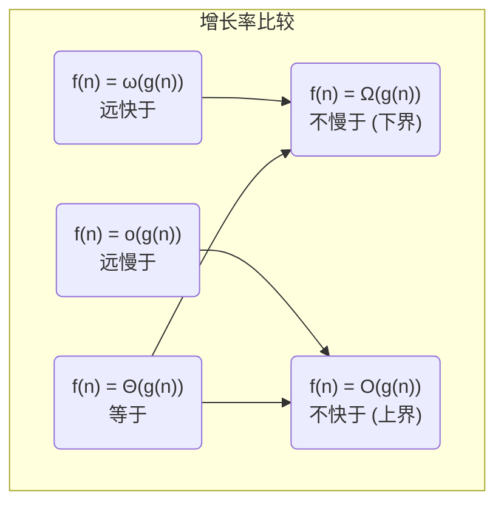

> DATA: 2025-07-09 23:51
> TAGS: [[数据结构]]
> Course: #比特数据结构
> Author: [ApolloMonasa](https://github.com/ApolloMonasa)
> Pre: #BEGIN 
> Next: [[1.2 均摊时间复杂度]]

# 1.1 时间复杂度
---

# 算法复杂度分析 

> [!NOTE] 本笔记定位
> 这是一份侧重于理论与定义的算法复杂度分析笔记，旨在系统性地介绍算法分析的核心概念。它遵循标准的计算机科学课程大纲，内容比日常使用的 [[时间复杂度]] 笔记更深入。

## 1. 基本操作数与时间复杂度

在分析算法前，我们首先要确定**基本操作**，即算法中执行次数与总运行时间成正比的最核心操作。例如，排序算法中的“比较操作”或“交换操作”。

**精确分析**：计算一个算法对特定规模 `n` 的输入所需基本操作的精确次数，得到函数 `T(n)`。这种方法非常繁琐，且依赖于具体的硬件和编译器，缺乏通用性。

**渐进分析 (Asymptotic Analysis)**：为了解决精确分析的局限性，我们引入渐进分析。我们不关心 `T(n)` 的精确表达式，只关心当输入规模 `n` 趋向于无穷大时，`T(n)` 的**增长数量级 (Order of Growth)**。这就是**时间复杂度**的本质。

## 2. 渐进符号的定义

渐进符号是用于描述函数增长率的数学工具。以下是五个核心的渐进符号。

> [!IMPORTANT] 核心定义
> 设 `f(n)` 和 `g(n)` 是定义在自然数集上的非负函数。

| 符号 | 名称 | 数学定义 | 直观解释 (f(n) 与 g(n) 的关系) |
| :--- | :--- | :--- | :--- |
| **O(g(n))** | **大O符号** (Big O) | 存在常数 `c>0` 和 `n₀`，使得对所有 `n ≥ n₀`，有 `0 ≤ f(n) ≤ c * g(n)`。 | `f(n)` 的增长**不快于** `g(n)` (渐进上界) |
| **Ω(g(n))** | **大Ω符号** (Big Omega) | 存在常数 `c>0` 和 `n₀`，使得对所有 `n ≥ n₀`，有 `0 ≤ c * g(n) ≤ f(n)`。 | `f(n)` 的增长**不慢于** `g(n)` (渐进下界) |
| **Θ(g(n))** | **大Θ符号** (Big Theta) | `f(n) = O(g(n))` **且** `f(n) = Ω(g(n))`。 | `f(n)` 的增长速度**等于** `g(n)` (渐进紧界) |
| **o(g(n))** | **小o符号** (Little o) | 对**任意**常数 `c>0`，都存在 `n₀`，使得对所有 `n ≥ n₀`，有 `0 ≤ f(n) < c * g(n)`。 | `f(n)` 的增长**远慢于** `g(n)` (非紧上界) |
| **ω(g(n))** | **小ω符号** (Little omega) | 对**任意**常数 `c>0`，都存在 `n₀`，使得对所有 `n ≥ n₀`，有 `0 ≤ c * g(n) < f(n)`。 | `f(n)` 的增长**远快于** `g(n)` (非紧下界) |

**图示理解：**

> [!TIP] 实际应用中的侧重
> - **大O (O)** 是我们日常沟通和衡量算法性能时最常用的，因为它提供了算法性能的**上限保证**（最坏情况）。
> - **大Θ (Θ)** 是最精确的描述，当一个算法的最佳和最差情况复杂度相同时，使用 Θ 更为严谨。
> - **大Ω (Ω)** 用于描述一个问题的**难度下限**（例如，基于比较的排序算法最好也只能是 Ω(n log n)）。

### 2.1 常见性质
- **传递性**: 若 `f(n) = Θ(g(n))` 且 `g(n) = Θ(h(n))`，则 `f(n) = Θ(h(n))`。(O, Ω, o, ω 均适用)
- **自反性**: `f(n) = Θ(f(n))`。(O, Ω 适用)
- **对称性**: `f(n) = Θ(g(n))` 当且仅当 `g(n) = Θ(f(n))`。
- **转置对称性**: `f(n) = O(g(n))` 当且仅当 `g(n) = Ω(f(n))`。

---

## 3. 时间复杂度计算示例

### 3.1 `for` 循环
- **单层循环**: `for i in 1..n`，复杂度为 **O(n)**。
- **嵌套循环**: `for i in 1..n: for j in 1..n`，复杂度为 **O(n²)**。
- **对数循环**: `while i < n: i = i * 2`，每次迭代问题规模减半，复杂度为 **O(log n)**。

### 3.2 深度优先搜索 (DFS)
对于图 `G = (V, E)`:
- 如果使用**邻接表**表示图，每个顶点和每条边都会被访问一次，所以时间复杂度为 **O(V + E)**。
- 如果使用**邻接矩阵**表示图，即使图是稀疏的，也需要检查每个顶点的所有可能邻居，时间复杂度为 **O(V²)**。

> [!TIP] 哪些量是常量?
> 在复杂度分析中，“常量”指的是**不依赖于输入规模 n 的任何量**。例如，数组中固定的前 10 个元素，或者循环 100 次。即使这个数字很大（如 10^6），只要它不随 `n` 变化，它就是常数项，在渐进分析中可以被忽略或记为 O(1)。

---

## 4. 主定理 (Master Theorem)

主定理是求解形如 `T(n) = aT(n/b) + f(n)` 的递归式时间复杂度的强大工具，其中 `a ≥ 1`, `b > 1`。这常用于分析[[分治算法]]。

**核心思想**：比较**子问题分解与合并的代价 `f(n)`** 和 **子问题数量决定的代价 `n^(log_b a)`**。

1.  **Case 1**: 如果 `f(n) = O(n^(log_b a - ε))` 对某个常数 `ε > 0` 成立（即 `f(n)` 的增长远慢于 `n^(log_b a)`），则 `T(n) = Θ(n^(log_b a))`。
    *   **直观理解**：代价由叶子节点主导。

2.  **Case 2**: 如果 `f(n) = Θ(n^(log_b a))`（即 `f(n)` 与 `n^(log_b a)` 增长速度相同），则 `T(n) = Θ(n^(log_b a) * log n)`。
    *   **直观理解**：代价均匀分布在树的每一层。
    *   **例子**: [[归并排序]] `T(n) = 2T(n/2) + O(n)`。这里 `a=2, b=2`, `log_b a = 1`。`f(n)=O(n)` 满足 `Θ(n^1)`，所以 `T(n) = Θ(n log n)`。

3.  **Case 3**: 如果 `f(n) = Ω(n^(log_b a + ε))` 对某个常数 `ε > 0` 成立，并且满足**正则条件** `a * f(n/b) ≤ c * f(n)` 对某个常数 `c < 1` 和足够大的 `n` 成立，则 `T(n) = Θ(f(n))`。
    *   **直观理解**：代价由根节点（合并/分解步骤）主导。

---

## 5. 均摊复杂度 (Amortized Complexity)

均摊复杂度分析的是**一系列操作**的平均成本，而不是单个最坏操作的成本。它保证了“平均”来看，每次操作的成本是低的，即使偶尔有一次操作成本很高。

**经典例子**: 动态数组（如 Python 的 `list`）的 `append` 操作。
- **多数情况**: 数组有空余容量，`append` 仅需 O(1)。
- **最坏情况**: 数组已满，需要分配一个更大的新数组（通常是两倍大小），并将所有旧元素复制过去，成本为 O(n)。
- **均摊分析**: 虽然一次操作可能很昂贵，但这次昂贵的操作为接下来的 `n` 次廉价操作创造了条件。将这次高昂的成本“摊销”到后续的多次操作上，可以证明 `append` 的**均摊时间复杂度为 O(1)**。

## 6. 空间复杂度 (Space Complexity)

空间复杂度 `S(n)` 衡量算法在执行过程中临时占用的**额外存储空间**随输入规模 `n` 的增长趋势。
- **额外空间**: 不包括输入数据本身占用的空间。
- **递归算法**: 需要考虑递归调用栈的深度。例如，一个递归深度为 `n` 的算法，其空间复杂度至少是 `O(n)`。

## 7. 计算复杂性 (Computational Complexity)

这是一个更高层次的概念，它研究的是**问题本身**的内在难度，而不是解决该问题的**某个特定算法**的效率。

- **时间/空间复杂度**: 分析的是**算法 (Algorithm)**。
- **计算复杂性**: 分析的是**问题 (Problem)**。

它试图回答：“对于某个问题，所有可能的算法中，最好的那个算法其复杂度是多少？” 这引出了复杂性类的概念，如 P 类问题、NP 类问题等。

- **[[P 类问题]]**: 存在一个多项式时间算法可以解决的问题。
- **[[NP 类问题]]**: 可以在多项式时间内**验证**一个解是否正确的问题。
- **[[P vs NP 问题]]**: 计算机科学领域最重要的未解之谜。

## Reference
- [OI-Wiki](https://oi-wiki.org/basic/complexity/)
---
Recommend Links
