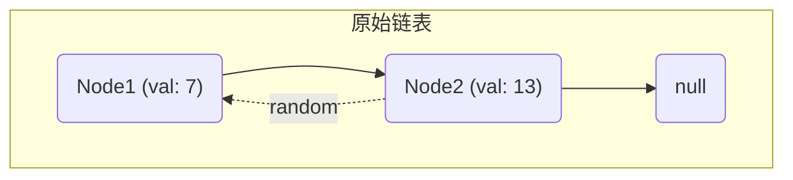
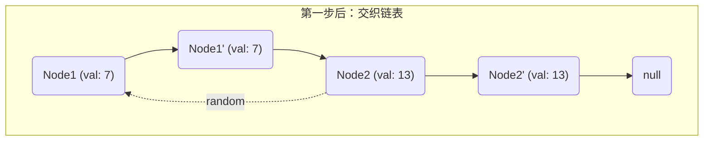
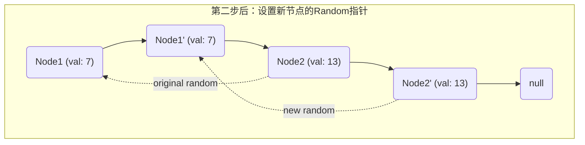
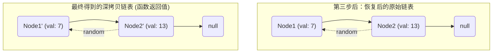

> DATA: 2025-07-12 09:03
> TAGS: [[数据结构]]
> Course: #比特数据结构 
> Author: [ApolloMonasa](https://github.com/ApolloMonasa)
> Repository: [CSNotes](https://github.com/ApolloMonasa/CSNotes) | [Code Is Here](https://gitee.com/xyl6716/data-structure-and-algorithm)
> Pre: [[2.1 顺序表]]
> Next: ???

# 2.3 单链表的应用
## 算法题
在开始做题之前，还是规矩，笔者简单说几点注意吧！
- [!] **解引用之前切记考虑这个指针是否可能为空**
- [!] 加强概念的印象，比如哪些地方建议把指针置空，比如链表的结尾。
- [!] 熟练掌握链表的**增删改查**。

### [移除链表元素](https://leetcode.cn/problems/remove-linked-list-elements/description/?page=1)
#### 虚拟头+遍历删除
![[Pasted image 20250712190850.png]]
这个技巧我们在上一节中说过，在此不会过多赘述。
#### 递归
![[Pasted image 20250712191846.png]]
这个问题具有递归性质，我们直接看代码就能看懂，调用自身处理从第二个节点往后的链表，再讨论要不要去除头节点。
### [反转链表](https://leetcode.cn/problems/reverse-linked-list/description/)
#### 头插 
![[Pasted image 20250712193309.png]]
遍历链表，每遍历到一个都头插到新链表上，很简单。
#### 直接反向
![[Pasted image 20250712194003.png]]
用三个指针，p3在前面记住p2的下一个位置，p1和p2用来反向，不难想到最后一次反向p2指向最后一个元素，那么下一次p2就指向NULL，所有终止条件是p2为NULL。
#### 递归
![[Pasted image 20250712194730.png]]
### [链表的中间结点](https://leetcode.cn/problems/middle-of-the-linked-list/)
#### 快慢指针
![[Pasted image 20250712195437.png]]
#### 数组法
遍历链表，存入数组，最后可以轻易取得中间值。
![[Pasted image 20250712195622.png]]
#### 先遍历计数
用单个指针，先遍历一遍得到链表长度，再遍历一遍取得中间值。
![[Pasted image 20250712195724.png]]
### [合并两个有序链表](https://leetcode.cn/problems/merge-two-sorted-lists/)
#### 归并排序
![[Pasted image 20250712215400.png]]
#### 递归
![[Pasted image 20250712215533.png]]
这两种方法其实本质上相同。
### [链表的回文结构](https://www.nowcoder.com/practice/d281619e4b3e4a60a2cc66ea32855bfa?tpId=182&tqId=34762&ru=/exam/oj)
#### 递归
这是比较容易想到的一个方法，每次比较链表的头和尾，然后剩下的部分调用自身进行判断。
就是时间复杂度有点高，是$O(n^2)$，能过，也推荐，如果数据加强，就要用其他方法了。
![[Pasted image 20250713113409.png]]

#### 反转后与自身比较
**其实无论判断回文结构一个重要且主要的方法就是反转后对比，如果相同就是回文结构**。
这个方法笔者尝试实现过，但是发生了段错误，我猜测是OJ不允许我开这么多的内存。
#### 反转后半段再比较
![[Pasted image 20250713115909.png]]
### [链表分割](https://www.nowcoder.com/practice/0e27e0b064de4eacac178676ef9c9d70)
#### 创建新链表
![[Pasted image 20250713122309.png]]
创建前后两个链表，一个放小于x的节点，其他的放另一个，最后把这两部分连接起来就行。

### [随机链表的复制](https://leetcode.cn/problems/copy-list-with-random-pointer/)
这题要求我们对这样的链表结构进行深拷贝，不能使用原有节点，需要自己开辟。
![[Pasted image 20250713163609.png]]
#### 回溯
可以用一个哈希表来记录"旧->新"的映射，并用递归函数的设计方式处理，如果为空就返回空指针，如果已经处理过就返回记录好的新节点，否则，我们就要再开辟一个节点进行深拷贝，同时也要记录这个新的映射，编码简单，建议掌握。
![[Pasted image 20250713164552.png]]
#### 复制分裂法
![[Pasted image 20250713165315.png]]
这个算法的核心思想是：

1.  **复制并交织**：在每个原始节点后面创建一个新的复制节点，将两个链表“编织”在一起。
2.  **链接随机指针**：利用交织的结构，轻松地为新节点设置 `random` 指针。
3.  **拆分链表**：将交织的链表拆开，恢复原始链表，并得到最终的深拷贝链表。

---

假设我们的原始链表如下：
*   有两个节点，Node1 (值为 7) 和 Node2 (值为 13)。
*   Node1 的 `next` 指向 Node2。
*   Node2 的 `next` 指向 `nullptr`。
*   Node1 的 `random` 指向 `nullptr`。
*   Node2 的 `random` 指向 Node1。

#### 初始状态

这是我们开始操作前的链表结构。



---

##### 第一步：复制节点并交错链接

对应代码：
```cpp
for (Node* node = head; node != nullptr; node = node->next->next) {
    Node* nodeNew = new Node(node->val);
    nodeNew->next = node->next;
    node->next = nodeNew;
}
```

**说明**：
我们遍历原始链表。对于每个节点 `node`，我们创建一个新的节点 `nodeNew`，并将其插入到 `node` 和 `node->next` 之间。

*   遍历到 `Node1`，创建 `Node1'`，将它插入到 `Node1` 和 `Node2` 之间。
*   遍历到 `Node2`，创建 `Node2'`，将它插入到 `Node2` 和 `null` 之间。

**操作后的状态**：
链表变成了 "原1 -> 新1 -> 原2 -> 新2 -> null" 的交织结构。此时，新节点的 `random` 指针还是空的。



---

##### 第二步：复制随机指针

对应代码：
```cpp
for (Node* node = head; node != nullptr; node = node->next->next) {
    Node* nodeNew = node->next;
    nodeNew->random = (node->random != nullptr) ? node->random->next : nullptr;
}
```

**说明**：
再次遍历这个交织的链表，这次我们专门处理 `random` 指针。
对于每个原始节点 `node`，它的复制节点 `nodeNew` 就在它的 `next` 位置。
关键在于： `nodeNew` 的 `random` 指针，应该指向 `node` 的 `random` 指针所指向节点的 **复制节点**。

由于我们的交织结构，`node->random` 指向的任何原始节点 `X`，它的复制节点 `X'` 恰好就是 `X->next`。
所以，我们可以通过 `node->random->next` 来找到正确的 `random` 目标。

*   **对于 Node1**: `node->random` 是 `nullptr`，所以 `Node1'` 的 `random` 也设为 `nullptr`。
*   **对于 Node2**: `node->random` 指向 `Node1`。那么 `Node2'` 的 `random` 就应该指向 `Node1` 的下一个节点，也就是 `Node1'`。即 `N2_copy->random = N2->random->next`。

**操作后的状态**：
新节点的 `random` 指针被正确设置。



---

##### 第三步：拆分两个链表

对应代码：
```cpp
Node* headNew = head->next;
for (Node* node = head; node != nullptr; node = node->next) {
    Node* nodeNew = node->next;
    node->next = node->next->next;
    nodeNew->next = (nodeNew->next != nullptr) ? nodeNew->next->next : nullptr;
}
return headNew;
```

**说明**：
最后一步，我们将这个交织的链表“解开”，分成两个独立的链表。
我们遍历链表，同时恢复原始链表的 `next` 指针和设置新链表的 `next` 指针。

*   **处理 Node1 和 Node1'**:
    *   `Node1->next` 从 `Node1'` 改为 `Node1'->next` (即 `Node2`)。
    *   `Node1'->next` 从 `Node2` 改为 `Node2->next` (即 `Node2'`)。
*   **处理 Node2 和 Node2'**:
    *   `Node2->next` 从 `Node2'` 改为 `Node2'->next` (即 `null`)。
    *   `Node2'->next` 从 `null` 改为 `null`。

经过这一步，我们就得到了两个完全解耦的链表：一个是恢复原状的原始链表，另一个是全新的深拷贝链表。

**最终状态**：



通过这三步，我们就在不使用额外哈希表的情况下，以 O(N) 的时间复杂度和 O(1) 的额外空间复杂度完成了链表的深拷贝。

## Reference

---
Recommend Links
