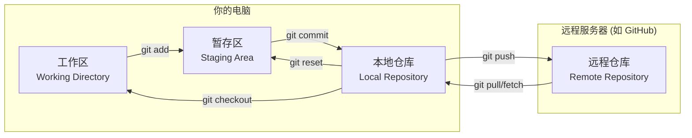

> DATA: 2025-07-09 23:48
> TAGS: [[工具]]
> Course:
> Author: [ApolloMonasa](https://github.com/ApolloMonasa)
> Pre: 
> Next:

# Git教程

---
> [!NOTE] 欢迎
> 这是一份为开发者和学习者准备的 Git 核心概念与常用命令笔记。

## 1. 核心概念：Git 是什么？

Git 是一个**分布式版本控制系统**。简单来说，它就像一个功能强大的存档和协作工具，可以：
- **记录文件历史**：你可以随时回到文件的任何一个历史版本。
- **支持团队协作**：多人可以同时在同一个项目上工作，而不会互相干扰。
- **保证代码安全**：即使你把代码改得一团糟，也能轻松恢复。

### Git 的三大区域

理解这三个区域是掌握 Git 的关键。



- **工作区 (Working Directory)**：你电脑上能看到的项目文件夹，是你直接编辑代码的地方。
- **暂存区 (Staging Area)**：一个临时的“购物车”。你把想提交的修改（“商品”）通过 `git add` 放进这里。
- **本地仓库 (Local Repository)**：你本地的最终数据库。当你 `git commit` 时，暂存区里的所有内容会被打包成一个版本（一个 Commit），并永久保存在本地仓库的 `.git` 目录中。
- **远程仓库 (Remote Repository)**：托管在网络服务器上的代码仓库（例如 GitHub, GitLab），用于团队协作和数据备份。

---

## 2. 初始配置 (只需一次)

> [!IMPORTANT] 首次安装 Git 后必须配置
> 这些信息会记录在你每一次的提交中，表明“你是谁”。

```bash
# 配置你的用户名
git config --global user.name "Your Name"

# 配置你的邮箱
git config --global user.email "your.email@example.com"

# (可选) 让 Git 的输出更好看
git config --global color.ui true
```
- `--global` 表示这是全局配置，对你电脑上所有的 Git 仓库都生效。

---

## 3. 基础工作流

### 创建或获取项目

**方式一：在本地初始化一个新仓库**
```bash
# 进入你的项目文件夹
cd my-project

# 初始化 Git 仓库
git init
```
这会在当前目录下创建一个 `.git` 文件夹，所有版本历史都存储在这里。

**方式二：从远程仓库克隆一个项目**
```bash
# 克隆一个远程项目到本地
git clone <repository-url>

# 示例：克隆 Obsidian 官方文档
# git clone https://github.com/obsidianmd/obsidian-docs.git
```

### 日常工作循环

这是你每天使用最多的命令。

**1. 查看状态 (`git status`)**
这是最常用的命令，用于检查当前工作区的状态。
```bash
# 查看哪些文件被修改了、哪些文件还未被追踪
git status
```

**2. 添加到暂存区 (`git add`)**
将你想要提交的修改放入“购物车”（暂存区）。
```bash
# 添加单个文件
git add README.md

# 添加某个目录下的所有文件
git add docs/

# 添加所有已修改和新创建的文件（最常用）
git add .
```

**3. 提交到本地仓库 (`git commit`)**
将暂存区的内容打包成一个版本，并永久记录到本地仓库。
```bash
# -m 参数允许你直接在命令行输入提交信息
git commit -m "feat: 添加用户登录功能"

# 如果没有 -m，会打开默认文本编辑器让你输入更详细的信息
git commit
```
> [!TIP] 好的 Commit Message 很重要
> 一个好的提交信息应该清晰地描述**做了什么**。通常遵循“类型: 简短描述”的格式，例如 `fix: 修复了 xxx bug` 或 `docs: 更新了 README 文件`。可以参考 [[Commit Message 规范]]。

**4. 查看历史 (`git log`)**
查看项目的所有提交历史。
```bash
# 查看完整的提交历史
git log

# 查看简化的单行历史
git log --oneline

# 查看带有分支关系图的单行历史（非常推荐！）
git log --oneline --graph --all
```
---

## 4. 分支管理：Git 的核心优势

分支允许你独立于主线（通常是 `main` 或 `master` 分支）开发新功能或修复 Bug，完成后再合并回主线。

> [!QUOTE] 最佳实践
> 永远不要直接在 `main` 分支上开发。为每一个新功能或修复创建一个新的分支。

### 常用分支命令

```bash
# 查看所有本地分支（当前分支会用 * 标记）
git branch

# 查看所有本地和远程分支
git branch -a

# 创建一个新分支（但仍停留在当前分支）
git branch feature/new-login

# 切换到指定分支
git checkout feature/new-login

# 创建并立即切换到新分支（上面两步的合体，推荐使用！）
git checkout -b feature/new-login

# 将 feature/new-login 分支的修改合并到当前分支（比如 main）
# 1. 首先切换回主分支
git checkout main
# 2. 执行合并
git merge feature/new-login

# 删除一个已经合并的分支
git branch -d feature/new-login

# 强制删除一个未合并的分支（慎用！）
git branch -D feature/new-login
```

### 解决合并冲突 (Merge Conflict)

> [!DANGER] 冲突！
> 当两个分支修改了同一个文件的同一部分时，Git 不知道该保留哪个版本，就会发生冲突。

解决步骤：
1.  运行 `git merge` 后，Git 会提示你哪些文件冲突了。
2.  打开冲突的文件，你会看到类似下面的内容：
    ```
    <<<<<<< HEAD
    这是你当前分支（如 main）的内容。
    =======
    这是你合并过来的分支（如 feature）的内容。
    >>>>>>> feature/new-login
    ```
3.  **手动编辑**文件，删除 `<<<<<<<`, `=======`, `>>>>>>>` 这些标记，并将代码修改为你最终想要的样子。
4.  保存文件后，使用 `git add .` 告诉 Git 你已经解决了冲突。
5.  最后，运行 `git commit` 来完成这次合并。（通常不需要写 commit message，Git 会为你生成一个）。

---

## 5. 远程协作

### 远程仓库命令

```bash
# 查看你配置的远程仓库
git remote -v

# 添加一个新的远程仓库（通常在你 git init 后需要手动添加）
# origin 是远程仓库的默认别名
git remote add origin <repository-url>

# 从远程仓库拉取最新的变更到本地（不合并）
git fetch origin

# 将本地的提交推送到远程仓库
# -u 参数会将本地的 main 分支与远程的 origin/main 分支关联起来，下次推送只需 git push
git push -u origin main

# 拉取远程仓库的变更并自动与本地分支合并（相当于 git fetch + git merge）
git pull origin main
```
> [!NOTE] `pull` vs `fetch`
> - `git fetch`：只下载远程的最新版本，但**不**修改你的工作区。你可以先看看别人改了什么再决定是否合并。
> - `git pull`：下载并**立即尝试合并**到你的当前分支。如果本地有未提交的修改，可能会失败。
> 对于新手，`git pull` 更直接。对于有经验的开发者，`git fetch` 更安全。

---

## 6. 后悔药：撤销操作

> [!WARNING] 撤销操作需要谨慎，特别是涉及 `reset --hard` 时。

| 命令 | 作用范围 | 描述 |
| --- | --- | --- |
| `git checkout -- <file>` | 工作区 | 撤销对某个文件的所有**未暂存**的修改，恢复到上一次提交时的状态。 |
| `git reset HEAD <file>` | 暂存区 | 将文件从暂存区（购物车）移回工作区，但**不**改变文件的实际内容。 |
| `git reset --soft <commit>` | 本地仓库 | “时光倒流”，将 `HEAD` 指针移到指定的 commit，但保留工作区和暂存区的修改。 |
| `git reset --hard <commit>` | **所有区域** | **【危险】** 彻底回滚到指定的 commit，工作区和暂存区的所有修改都会被**永久删除**。 |
| `git revert <commit>` | 本地仓库 | 创建一个**新的提交**，其内容与指定的旧提交**相反**。这是一种安全的“撤销”方式，因为它不修改历史。 |

### 临时保存修改 (`git stash`)

当你正在一个分支上开发，但需要紧急切换到另一个分支修复 Bug 时，可以使用 `stash`。

```bash
# 将所有未提交的修改（包括暂存区）保存起来，让工作区变干净
git stash

# ...切换到其他分支做你的事...

# 完成后，切回原来的分支
git checkout feature/new-login

# 恢复之前保存的修改
git stash pop
```

---

## 7. 进阶知识点 (可创建新笔记链接)

- [[.gitignore 文件详解]]：告诉 Git 哪些文件或文件夹不需要进行版本控制。
- [[Git-rebase 的艺术]]：学习如何用 `rebase` 来保持一个干净、线性的提交历史。
- [[Git-tag 的使用]]：如何为重要的版本（如 `v1.0.0`）打上标签。
- [[Git 别名配置]]：为常用但冗长的命令创建快捷方式，提升效率。

## Reference

---
Recommend Links
